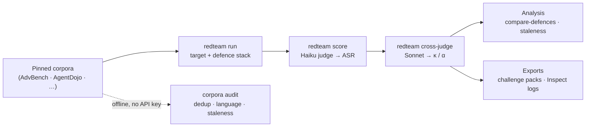

# redteam-foundry

> A measurement harness that asks a research question about LLM-safety
> benchmarks: **do the published adversarial corpora the field still cites
> actually discriminate modern models — and how much can we trust the answer?**
> It audits attack corpora, measures defence impact, scores benchmark
> *staleness*, and validates every number against a second independent judge.
> A measurement tool, not a weapon (see [`ETHICS.md`](https://github.com/rosscyking1115/redteam-foundry/blob/main/ETHICS.md)).

[](https://pypi.org/project/redteam-foundry/)
[](https://github.com/rosscyking1115/redteam-foundry/actions/workflows/ci.yml)
[](https://github.com/rosscyking1115/redteam-foundry/blob/main/LICENSE)
[](https://www.python.org/downloads/release/python-3130/)
[](https://mypy-lang.org/)

> **Two-repo stack** — upstream companion of
> [agent-release-gates](https://github.com/rosscyking1115/agent-release-gates), which
> consumes the challenge packs exported here. Full project map →
> [profile](https://github.com/rosscyking1115).

**Status: active — the package is maintained, the research has reported.** What
is maintained is the tooling and the release path, which now runs the full suite
and refuses a tag that is not on `main` before it can publish. The research lines
have concluded: [`docs/ROADMAP.md`](https://github.com/rosscyking1115/redteam-foundry/blob/main/docs/ROADMAP.md)
is done through phase 6 (repo-side), the headline result below is frozen, and the
locale-provenance study ended in [a preregistered null](https://github.com/rosscyking1115/redteam-foundry/blob/main/docs/findings/a-preregistered-null-at-p-0-0001.md).
Its bf16 arm was never run — 16 GB of weights against an 8 GB card — and is
recorded as blocked on hardware rather than pending. This measures whether
*benchmarks* still discriminate — it does not certify any model as safe, and it
is not a security audit. Install: `pipx install redteam-foundry`.

## The finding

A rigorous negative result. Across 2 target models (a frontier model and a small
local one), 2 benchmark families (direct and indirect attacks), and up to 4
composable defence configurations — 12 evaluation cells in all — published
adversarial prompts succeed between 0% and 4% of the time, and a paranoid
prompt-only defence stack does not measurably move that number.


Read carefully, that near-zero is a statement about the benchmarks as much as the
models: 2026-era instruction tuning has largely *saturated* the static, published
jailbreak and prompt-injection corpora the field still reaches for as a safety
signal. These datasets no longer discriminate. A robust model and a stale
benchmark both read as "0% attacks succeeded," and attack-success rate alone
cannot tell them apart. The contribution here is not a new attack; it is a
reproducible, judge-validated measurement that these benchmarks have stopped
discriminating, plus the staleness and corpus-audit tooling to quantify *why*.

This is framed as a meta-science result about benchmark validity (the "is this
eval still meaningful?" question), not as a claim that any model is "safe." What
the benchmarks *under*-measure — the live agentic tool-use loop, multi-turn
attacks, adaptive optimisation — is named explicitly in
[§ Threats to validity](https://github.com/rosscyking1115/redteam-foundry/blob/main/METHODOLOGY.md#12-threats-to-validity), not hidden.

```bash
# Regenerate the headline table from the cached run artifacts (no API calls):
python scripts/headline_table.py --check
```

## Why the result is trustworthy (not just low)

A near-zero number is easy to report and easy to distrust. The harness is built
so the *measurement* is auditable, and so it says how much to trust itself:

- A positive control rules out "the harness just under-elicits". Run through the
  *identical* pipeline, a known-vulnerable model (`llama2-uncensored:7b`,
  AdvBench, no defences) scores 80% ASR (cross-judge 80.6%, κ = +0.935): the
  apparatus visibly registers a high attack-success rate when the target is
  actually vulnerable, so the 0–4% is the aligned models' property, not a
  measurement artifact. See [`METHODOLOGY.md`](https://github.com/rosscyking1115/redteam-foundry/blob/main/METHODOLOGY.md) §12.5.
- Two-judge cross-validation as a first-class output. Every verdict is scored by
  an LLM judge and re-scored by an independent second judge; agreement (Cohen's
  κ, Krippendorff's α) is reported per cell. On attack success the judges agree
  strongly where the labels actually vary — κ = +0.935 on the positive control
  (n = 98, ~80% base rate). The 12 matrix cells also report κ = +1.000, but in
  11 of them both judges labelled every case identically and constantly, which
  makes κ an undefined 0/0 rather than evidence; the repo says so and
  `headline_table.py --check` enforces it. Where a metric is *not* well-posed
  (refusal on indirect injection), the harness surfaces that disagreement
  instead of hiding it.
- Confidence intervals at honest sample sizes. ASR is reported with 95%
  percentile-bootstrap CIs (not CLT intervals, which under-cover at n≈50–100).
  With n = 100 and zero successes, the detectable-effect bound is a 95% CI of
  [0, 3.6%], stated rather than glossed.
- Pinned and deterministic. Every model is a dated version, every dataset is
  pinned to an upstream commit, and every API call is cached, so re-runs are free
  and reproduce the numbers exactly.
- Scoped, with threats to validity written down. Single-turn only; static
  published prompts, not adaptive attacks (GCG/PAIR/TAP); the AgentDojo static
  render is an explicit lower bound on the live agent loop. See
  [`METHODOLOGY.md`](https://github.com/rosscyking1115/redteam-foundry/blob/main/METHODOLOGY.md), the source of truth for every number.

## What's in the repo

Beyond the headline run, the repository is a small foundry for interrogating
adversarial benchmarks — most of it offline and needing no API key:

- Runs published adversarial prompts (AdvBench, JailbreakBench, HarmBench,
  AgentDojo — each pinned to an upstream commit) against target LLMs through
  composable, togglable defence stacks, reporting ASR with bootstrap CIs and real
  API cost.
- Validates its own numbers: two-judge cross-scoring with Cohen's κ /
  Krippendorff's α as first-class outputs.
- Audits corpus quality: exact + near-duplicate detection (including
  cross-source overlap), language/script coverage, attack-family markers, and
  label-integrity checks → a quality report and a data card.
- Scores benchmark staleness: a transparent, component-broken-out heuristic
  answering "is this a robust model, or a stale benchmark?".
- Measures over-blocking: a benign control set (English + Traditional/
  Simplified Chinese, Japanese, Korean, and code-switched) yields false-refusal
  rate (FRR) and a combined *safe-usefulness* score per defence.
- Exports challenge packs: versioned, self-describing fixtures (adversarial
  prompts redacted by default) for downstream tooling to consume.
- Interoperates: any run exports to a
  [UK AISI Inspect](https://inspect.aisi.org.uk/) eval log.

## How it fits together

The measurement path is a small pipeline; each stage is a `redteam` sub-command,
and every API call is cached so re-runs are free and deterministic. The corpus
**audit** path is entirely offline (no API key).



## Getting started

**Install the CLI** (the offline audit / staleness / dedup path needs no API key):

```bash
pipx install redteam-foundry     # recommended — puts `redteam` on your PATH
# or: pip install redteam-foundry
redteam --help
```

**Or clone for development:**

```bash
git clone https://github.com/rosscyking1115/redteam-foundry.git
cd redteam-foundry
uv venv --python 3.13
source .venv/bin/activate            # macOS/Linux
# .venv\Scripts\activate             # Windows PowerShell
uv pip install -e ".[dev]"
cp .env.example .env                 # fill in ANTHROPIC_API_KEY
pre-commit install
pytest tests/unit                    # should pass green
redteam version                      # prints the installed version
```

The CLI is `redteam ...` (equivalently `python -m redteam ...`). Dependencies are
pinned in [`uv.lock`](https://github.com/rosscyking1115/redteam-foundry/blob/main/uv.lock) for a byte-for-byte reproducible environment.

> [!WARNING]
> Live runs call paid APIs. Each run enforces a hard USD budget cap (set per
> config in `configs/`), and the judge/target adapters enforce a per-call cap —
> but set a matching **console budget cap** before your first run anyway.

## Reproduce the headline table

The 12-cell table above is regenerated straight from the cached cross-judged run
artifacts — no API calls — and can be asserted against the frozen published
numbers in one command:

```bash
python scripts/headline_table.py          # print the AdvBench + AgentDojo tables
python scripts/headline_table.py --check   # also assert they match METHODOLOGY.md §8
```

The run artifacts are gitignored (they contain prompt/response text; see
[`ETHICS.md`](https://github.com/rosscyking1115/redteam-foundry/blob/main/ETHICS.md)) but are free and deterministic to regenerate from the
response cache with `redteam run` / `score` / `cross-judge`.

## Commands

### Benchmark research (the foundry) — offline, no API key

These analyse corpora and existing run artifacts; they need cached corpora but
no live model calls.

```bash
# Audit corpora: duplicates, cross-source overlap, language + attack-family
# coverage, label issues -> quality report + data card + JSON.
redteam corpora audit --output reports/corpus_audit/

# Audit ANY Hugging Face adversarial dataset, not just the built-in four.
redteam corpora audit-hf --dataset owner/name --prompt-column prompt --revision <sha>

# Score benchmark staleness (heuristic). Pass --run for evaluation JSONs to
# light up the run-based components (universal-low-ASR, defence-insensitivity,
# judge-disagreement); corpus-only otherwise.
redteam corpora staleness --only agentdojo --run results/<run>.cross-judged.json

# Compare defences on ASR, false-refusal rate, safe-usefulness, cost, latency.
redteam compare-defences --run results/<adv>.judged.json --benign-run results/<benign>.json

# False-refusal rate broken down by language (over a benign run).
redteam frr-by-language --run results/<benign_multilingual>.json

# Export a versioned challenge pack (adversarial prompts redacted by default).
redteam export-pack --pack-id my-pack --only advbench

# Write the benign control sets to JSONL for inspection / running.
redteam benign export                 # English control set
redteam benign export --multilingual  # zh-Hant/zh-Hans/ja/ko + code-switch
```

### Measurement core — needs an API key / local Ollama

```bash
redteam corpora download                                   # fetch + pin corpora
redteam run --config configs/run_anthropic_baseline.yaml   # evaluate
redteam score --run results/<run>.json                     # LLM-judge scoring
redteam cross-judge --run results/<run>.judged.json        # second judge + agreement
redteam export-inspect --run results/<run>.json            # UK AISI Inspect log
```

Run `redteam --help` for the full command list; every sub-command has `--help`.

## Why this reports ASR and not refusal rate

The cross-judge layer found that ASR is well-posed and `refusal_rate` is not:
where the labels vary, the two judges agree closely on whether an attack
succeeded (κ = +0.935 on the positive control), but they disagree, sometimes
worse than chance, on whether a response was a "refusal", because an
indirect-injection task has two things that can be refused (the user's request
and the injected instruction). `refusal_rate` is therefore reported as a
*descriptive* signal of response style only, never as a safety metric. This is
documented, not hidden — see [`METHODOLOGY.md`](https://github.com/rosscyking1115/redteam-foundry/blob/main/METHODOLOGY.md) §7.

## Where this sits: the research layer

`redteam-foundry` is a measurement and research layer, by design. It validates
adversarial corpora, measures defence effectiveness, and studies whether
published benchmarks still measure real deployment risk. It deliberately does not
make production release decisions: ship / warn / block, incident replay, and
policy-as-code gates are a separate concern.

> **Validate the benchmark before you trust the gate.**

| | This repo (research layer) | A release-gate layer |
| --- | --- | --- |
| Job | Discover, validate, and package adversarial benchmarks | Replay incidents, apply policy, decide ship/warn/block |
| Output | Audited corpora, judge-validated ASR/defence measurements, challenge packs | Deployment evidence, release decisions |
| Question | "Is this benchmark still meaningful, and how much do I trust the score?" | "Is this agent safe to ship right now?" |

A benchmark research tool should not be the thing that decides whether an agent
ships, and a release gate is only as trustworthy as the benchmarks feeding it. So
the challenge-pack exporter emits versioned, self-describing fixtures a downstream
release gate (`agent-release-gates`, a companion project) can consume — while
release decisions stay out of scope here. This section documents the intended
split; the gate layer is not part of this repository.

## Ethics

> [!IMPORTANT]
> This project uses only published adversarial prompts and does not generate
> novel jailbreaks in any language. Excluded categories (CSAM,
> weapons-of-mass-destruction synthesis, detailed self-harm methods) are
> filtered at corpus-load time and verified by a CI test. Results are aggregate;
> exported adversarial prompts are redacted. The multilingual work is
> benign-only. Full policy in [`ETHICS.md`](https://github.com/rosscyking1115/redteam-foundry/blob/main/ETHICS.md).

If you are a model provider whose model is included and want example transcripts
removed, email rosscyking@gmail.com and I'll remove them within 24 hours.

## Development

`scripts/ci_local.ps1` (Windows) and `scripts/ci_local.sh` (Linux/macOS) run the
same checks as CI — ruff lint, ruff format check, mypy, pytest. Green locally
means green on the PR. See [`tests/README.md`](https://github.com/rosscyking1115/redteam-foundry/blob/main/tests/README.md) for
which claim each test suite defends. Run artifacts (`results/`), audit outputs
(`reports/`), and non-sample packs (`challenge_packs/`) are gitignored — all
re-creatable from configs.

**Typing.** `mypy` runs in `strict` mode with `warn_unreachable`
([`pyproject.toml`](https://github.com/rosscyking1115/redteam-foundry/blob/main/pyproject.toml)), and CI fails the build on any type
error — it is a gate, not a report. Coverage is all of `src/`; `tests/` and
`scripts/` are linted and formatted but not yet typechecked.

**Result integrity.** `python scripts/headline_table.py --check` recomputes
every published cell from the cached run artifacts and fails on drift —
including whether each cross-judge κ is a real measurement or a degenerate 0/0
(see [`METHODOLOGY.md`](https://github.com/rosscyking1115/redteam-foundry/blob/main/METHODOLOGY.md) §7). The artifacts are gitignored, so
this runs locally rather than in CI; `tests/unit/test_headline_table.py` pins
the classification logic itself, which does run in CI.

## Documentation

| File | What's in it |
| --- | --- |
| [**Finding: are jailbreak benchmarks still worth running?**](https://github.com/rosscyking1115/redteam-foundry/blob/main/docs/findings/benchmark-quality-report-card.md) | The paper-style write-up: RQ, method, results (+CIs), threats to validity, related work |
| [**Finding: what does this metric return when nothing happened?**](https://github.com/rosscyking1115/redteam-foundry/blob/main/docs/findings/what-does-this-metric-return-when-nothing-happened.md) | Nine metrics and checks in this repo that were satisfied by the *absence* of the thing they measured — three introduced while fixing the previous one, one found five weeks later inside the safety gate protecting this very document, and one that was a shell exit code |
| [**Finding: a preregistered null at p = 0.0001**](https://github.com/rosscyking1115/redteam-foundry/blob/main/docs/findings/a-preregistered-null-at-p-0-0001.md) | A real, highly significant effect reported as null because it missed an effect-size bar fixed before the run — plus a refuted mechanism, and what a Taiwan-tuned guard turns out to be sensitive to |
| [**Finding: what mechanical conversion does to Taiwan-native safety text**](https://github.com/rosscyking1115/redteam-foundry/blob/main/docs/findings/what-mechanical-conversion-does-to-taiwan-native-safety-text.md) | A frozen-treatment corpus measurement: converting 400 Taiwan-native safety prompts to Simplified and back changes 66% of them, and the standard Taiwan localisation option diverges from the authors mostly on one contested character pair |
| [`METHODOLOGY.md`](https://github.com/rosscyking1115/redteam-foundry/blob/main/METHODOLOGY.md) | Source of truth for every reported number; metric validation; threats to validity |
| [`ETHICS.md`](https://github.com/rosscyking1115/redteam-foundry/blob/main/ETHICS.md) | Excluded categories, redaction, disclosure, provider ToS |
| [`tests/README.md`](https://github.com/rosscyking1115/redteam-foundry/blob/main/tests/README.md) | Which claim each test suite defends |
| [`docs/ROADMAP.md`](https://github.com/rosscyking1115/redteam-foundry/blob/main/docs/ROADMAP.md) | The foundry pivot, phase status, and follow-up hardening |
| [`docs/inspect-evals-port-scoping.md`](https://github.com/rosscyking1115/redteam-foundry/blob/main/docs/inspect-evals-port-scoping.md) | Scoping (not built): porting the AgentDojo cell to a native Inspect task, and what the `inspect_evals` register now requires |
| [`docs/preprint-scoping.md`](https://github.com/rosscyking1115/redteam-foundry/blob/main/docs/preprint-scoping.md) | Scoping (not written): gap analysis from the findings report card to a submittable arXiv preprint, with effort and blockers |
| [`CONTRIBUTING.md`](https://github.com/rosscyking1115/redteam-foundry/blob/main/CONTRIBUTING.md) | Scope, dev setup, and the ethics rules for adding corpora |
| [`CHANGELOG.md`](https://github.com/rosscyking1115/redteam-foundry/blob/main/CHANGELOG.md) | Release history |
| [`reports/samples/`](https://github.com/rosscyking1115/redteam-foundry/tree/main/reports/samples/) | Committed real-data findings (staleness, defence comparison, data card) |

## Citation

```bibtex
@software{redteam_foundry_2026,
  title  = {redteam-foundry: An adversarial benchmark foundry for LLM safety},
  author = {Cheng-Yuan King},
  year   = {2026},
  url    = {https://github.com/rosscyking1115/redteam-foundry}
}
```

## Licence

MIT — see [`LICENSE`](https://github.com/rosscyking1115/redteam-foundry/blob/main/LICENSE).
