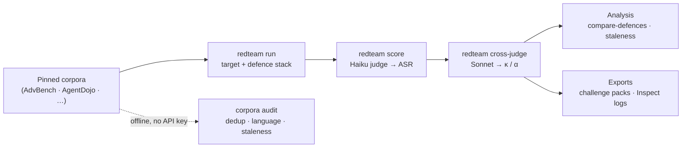

# Command reference

Every sub-command also has `--help`; `redteam --help` lists them all. The CLI is
`redteam ...`, equivalently `python -m redteam ...`.

The repository splits cleanly in two. The **foundry** path analyses corpora and
existing run artifacts and needs no API key. The **measurement core** calls
models and costs money.

## Benchmark research (the foundry) — offline, no API key

These analyse corpora and existing run artifacts. They need cached corpora but
no live model calls.

```bash
# Audit corpora: duplicates, cross-source overlap, language + attack-family
# coverage, label issues -> quality report + data card + JSON.
redteam corpora audit --output reports/corpus_audit/

# Audit ANY Hugging Face adversarial dataset, not just the built-in four.
redteam corpora audit-hf --dataset owner/name --prompt-column prompt --revision <sha>

# Score benchmark staleness (heuristic). Pass --run for evaluation JSONs to
# light up the run-based components (universal-low-ASR, defence-insensitivity,
# judge-disagreement); corpus-only otherwise.
redteam corpora staleness --only agentdojo --run results/<run>.cross-judged.json

# Compare defences on ASR, false-refusal rate, safe-usefulness, cost, latency.
redteam compare-defences --run results/<adv>.judged.json --benign-run results/<benign>.json

# False-refusal rate broken down by language (over a benign run).
redteam frr-by-language --run results/<benign_multilingual>.json

# Export a versioned challenge pack (adversarial prompts redacted by default).
redteam export-pack --pack-id my-pack --only advbench

# Write the benign control sets to JSONL for inspection / running.
redteam benign export                 # English control set
redteam benign export --multilingual  # zh-Hant/zh-Hans/ja/ko + code-switch
```

## Measurement core — needs an API key or a local Ollama

```bash
redteam corpora download                                   # fetch + pin corpora
redteam run --config configs/run_anthropic_baseline.yaml   # evaluate
redteam score --run results/<run>.json                     # LLM-judge scoring
redteam cross-judge --run results/<run>.judged.json        # second judge + agreement
redteam export-inspect --run results/<run>.json            # UK AISI Inspect log
```

> [!WARNING]
> Live runs call paid APIs. Each run enforces a hard USD budget cap (set per
> config in `configs/`), and the judge and target adapters enforce a per-call
> cap — but set a matching **console budget cap** before your first run anyway.

## How the stages fit together

Each stage is a `redteam` sub-command, and every API call is cached, so re-runs
are free and deterministic. The corpus **audit** path is entirely offline.



## What the foundry does, beyond the headline run

- Runs published adversarial prompts (AdvBench, JailbreakBench, HarmBench,
  AgentDojo — each pinned to an upstream commit) against target LLMs through
  composable, togglable defence stacks, reporting ASR with bootstrap CIs and real
  API cost.
- Validates its own numbers: two-judge cross-scoring with Cohen's κ and
  Krippendorff's α as first-class outputs.
- Audits corpus quality: exact and near-duplicate detection (including
  cross-source overlap), language and script coverage, attack-family markers, and
  label-integrity checks, producing a quality report and a data card.
- Scores benchmark staleness: a transparent, component-broken-out heuristic
  answering "is this a robust model, or a stale benchmark?".
- Measures over-blocking: a benign control set (English plus Traditional and
  Simplified Chinese, Japanese, Korean, and code-switched prompts) yields
  false-refusal rate and a combined *safe-usefulness* score per defence.
- Exports challenge packs: versioned, self-describing fixtures, with adversarial
  prompts redacted by default, for downstream tooling to consume.
- Interoperates: any run exports to a [UK AISI Inspect](https://inspect.aisi.org.uk/)
  eval log.

## Related

- [Getting started](getting-started.md) — install, development setup, reproducing
  the headline table
- [`METHODOLOGY.md`](../METHODOLOGY.md) — the source of truth for every number
